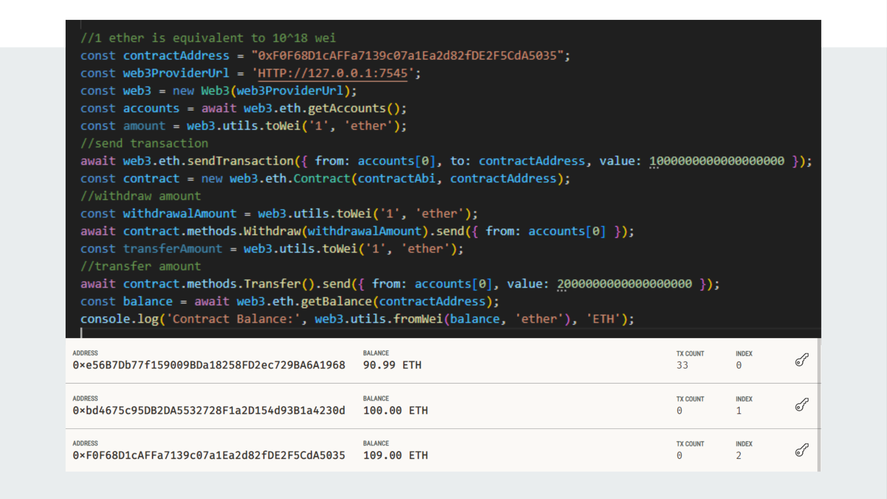
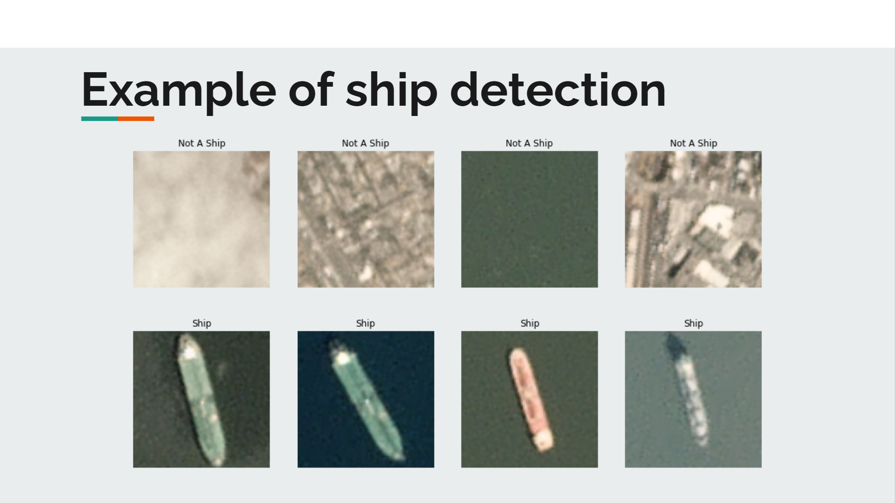
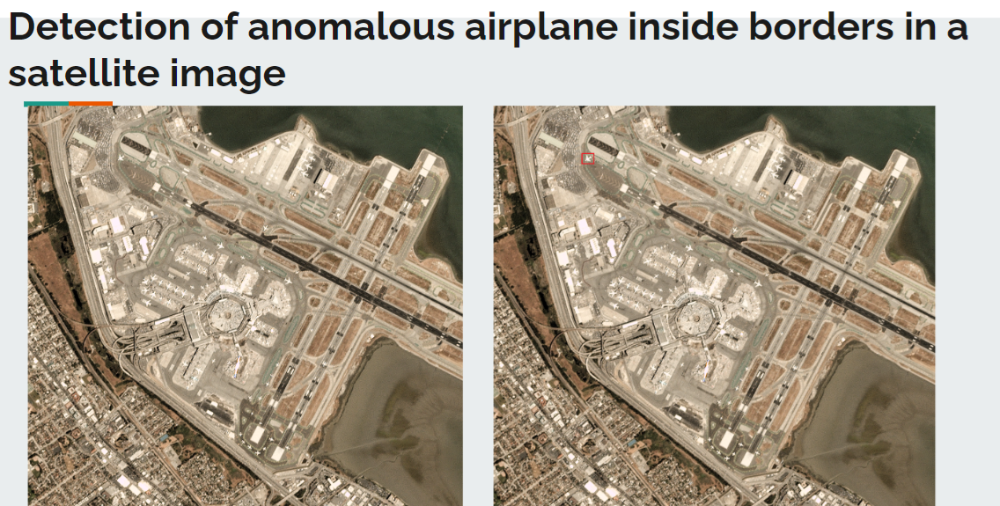
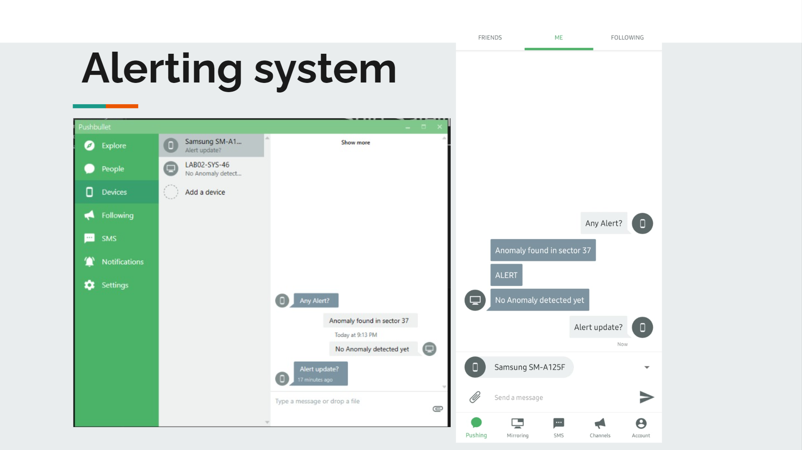
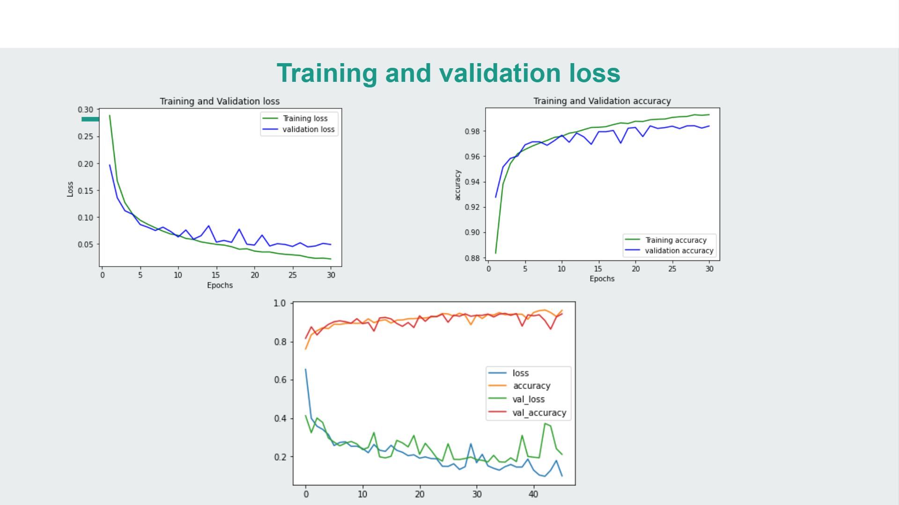

# Modernising Military Infrastructure

## Funds Transaction Management

This feature serves as a platform for managing funds transactions utilizing blockchain technology. Transactions including additions, withdrawals, and any other fund-related activities are securely recorded and tracked within this system. All modifications and accesses to this platform are meticulously logged for transparency and accountability.

### Technologies Used

- **Blockchain**: Utilized for secure and immutable record-keeping of funds transactions.
- **Web3**: Facilitates interaction with the blockchain network.
- **Solidity**: Smart contract language for implementing business logic on the blockchain.
- **Truffle**: Development framework for Ethereum-based decentralized applications.
- **React**: JavaScript library used for building the frontend user interface.

### Features

- **Transparent Transaction Records**: Every fund-related action is recorded and stored securely on the blockchain.
- **Immutable Ledger**: The use of blockchain ensures that transaction records are tamper-proof and transparent.
- **User-Friendly Interface**: The frontend, built with React, provides an intuitive and accessible platform for managing funds transactions.

## Satellite Image Anomaly Detection System

This feature contains a system designed for detecting anomalies in satellite images of planes and ships. The system is trained on a dataset comprising satellite images using Convolutional Neural Networks (CNN), Artificial Neural Networks (ANN), and Computer Vision (CV) techniques.

Objective here is to create a real-time anomaly detection system capable of continuously analyzing satellite images. If any anomaly is detected in these images, an alert is sent to the administrator device. Additionally, the system supports the connection of multiple devices, with notifications delivered to all connected devices using PushBullet.

## Technologies Used

- **Dataset**: A collection of satellite images of planes and ships.
- **Models**: Utilizes CNN, ANN, and CV algorithms for image analysis and anomaly detection.
- **Real-time Data Streaming**: Continuously receives images at intervals of 2-3 seconds for analysis.
- **Alert System**: Sends alerts to the admin device upon detecting anomalies.
- **PushBullet**: Used for sending notifications to all connected devices.

## Features

- **Real-time Image Analysis**: Constantly analyzes incoming satellite images for anomalies.
- **Anomaly Detection**: Utilizes machine learning models to identify anomalies in the images.
- **Alert Notification**: Sends immediate alerts to the administrator device upon anomaly detection.
- **Scalability**: Supports the connection of multiple devices for receiving notifications.

## Model Accuracy

The accuracy metrics for the trained models are as follows:

- **Plane Model**: 98% accuracy with 0.02 loss.
- **Ship Model**: 96% accuracy with 0.08 loss.

These metrics demonstrate the high accuracy and low loss rates achieved by the models, ensuring effective anomaly detection in satellite images of planes and ships.

